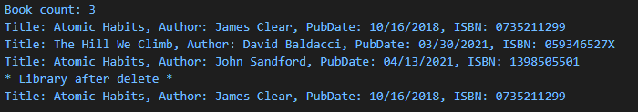

## Purpose

- Create a digital book library using JavaScript classes
- Practice using classes and constructors to develop a program that can add and delete user input datas

Output of digital book library

[code file for book library](https://github.com/Jiah-design/cit281-lab6/blob/main/lab-06.js)

